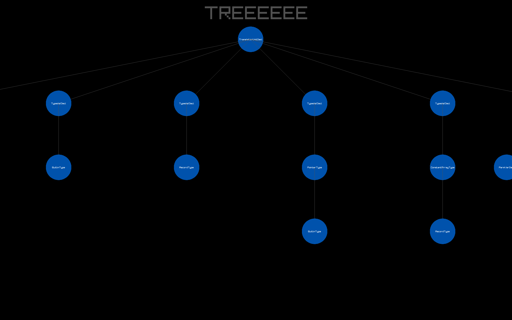

# ASTViz

Visualize and grep through the AST nodes for your codebases.

> What are ASTs you might ask? [Here you go](https://ruslanspivak.com/lsbasi-part7/)




## Build Instructions

1. Clone this repo

2. Run the following commands in the project folder
```sh
mkdir build && cd build
cmake ../
make
```

# Usage

> It is advised to have `clang` on your system for generating the AST.

```sh
# Where x.c is a random C source file.
clang -Xclang -ast-dump=json -fsyntax-only x.c > ast.json
```


```sh
./plot <path-to-json-file>
```

## Resources
[Jonas Devlieghere's Blog](https://jonasdevlieghere.com/post/understanding-the-clang-ast/)

[Official Clang AST documentation](https://clang.llvm.org/docs/IntroductionToTheClangAST.html)

[Baby steps with LibClang](https://bastian.rieck.me/blog/2015/baby_steps_libclang_ast/)
